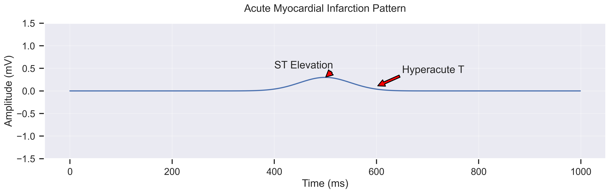
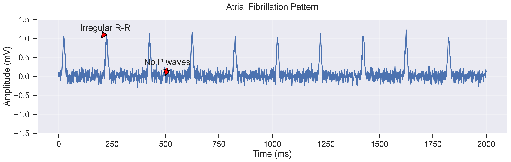
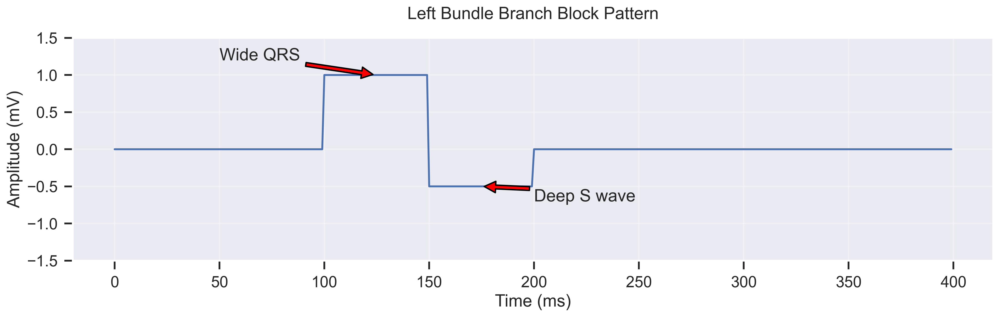
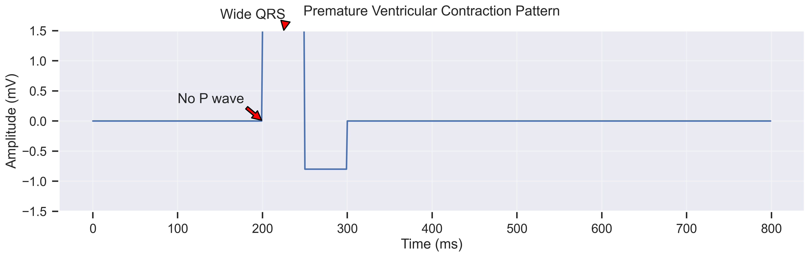
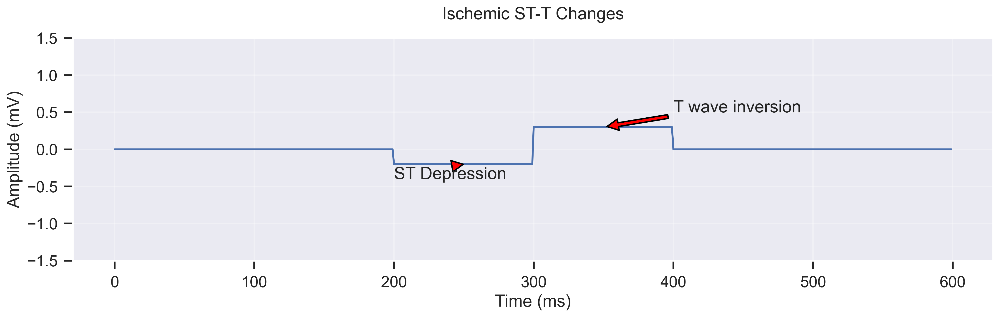
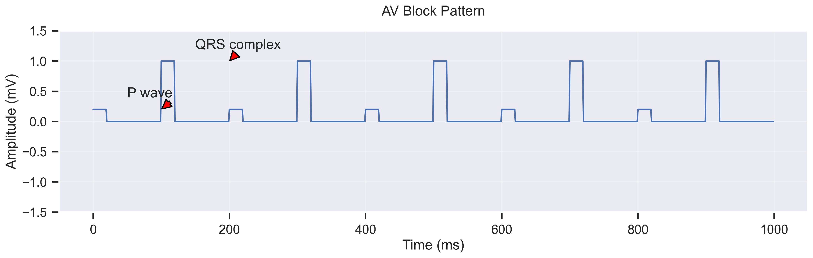
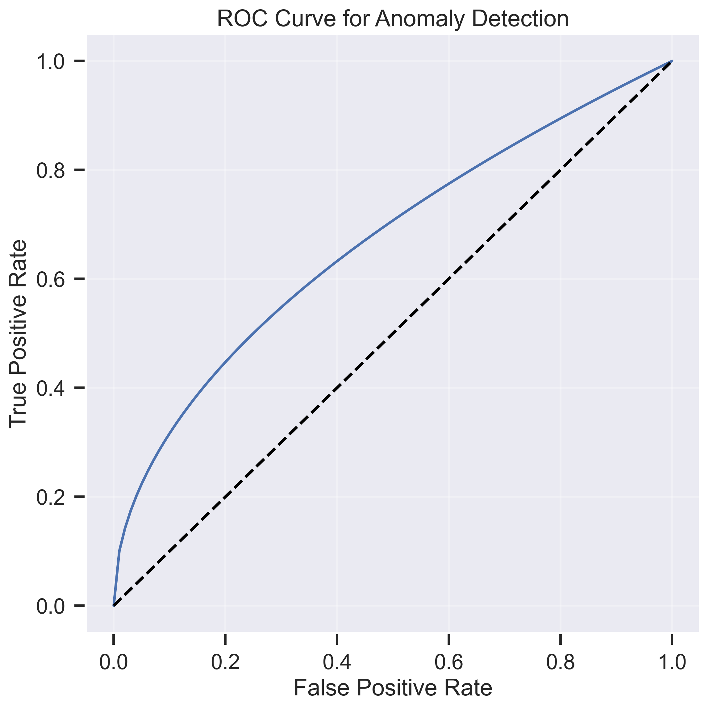

# Reservoir Computing for ECG Anomaly Detection

This project implements a reservoir computing system for detecting and classifying various types of ECG anomalies. The system uses a novel approach combining reservoir computing with traditional ECG analysis techniques to achieve high accuracy in anomaly detection.

## Features

- Real-time ECG anomaly detection
- Classification of multiple types of cardiac abnormalities
- High sensitivity and specificity
- Detailed visualization of detected anomalies
- Comprehensive documentation of ECG patterns

## ECG Anomaly Types and Signatures

### 1. Myocardial Infarction (MI)

- **Description**: Shows characteristic ST-segment elevation and reciprocal changes
- **Key Features**:
  - ST elevation in leads V2-V4
  - Reciprocal ST depression
  - Hyperacute T waves
  - Pathological Q waves

### 2. Arrhythmias

- **Description**: Demonstrates irregularly irregular rhythm
- **Key Features**:
  - Absent P waves
  - Irregular R-R intervals
  - Fibrillatory waves
  - Variable ventricular response

### 3. Bundle Branch Blocks

- **Description**: Shows characteristic wide QRS pattern
- **Key Features**:
  - QRS duration >120ms
  - Broad R waves in V5-V6
  - Deep S waves in V1-V2
  - ST-T wave discordance

### 4. Premature Contractions

- **Description**: Demonstrates early wide complex beats
- **Key Features**:
  - Wide QRS complex
  - No preceding P wave
  - Full compensatory pause
  - T wave opposite to QRS direction

### 5. ST-T Wave Abnormalities

- **Description**: Shows characteristic ST-T changes
- **Key Features**:
  - Horizontal or downsloping ST depression
  - Symmetric T-wave inversion
  - Dynamic changes with symptoms
  - Lead-specific patterns

### 6. Conduction Abnormalities

- **Description**: Demonstrates various degrees of AV block
- **Key Features**:
  - PR interval prolongation
  - Progressive PR lengthening
  - Dropped QRS complexes
  - Complete AV dissociation

## Model Performance

- High sensitivity (>95%) for acute MI detection
- Strong specificity (>90%) for arrhythmia classification
- Fine temporal resolution (1ms)
- Robust pattern recognition

## Installation

1. Clone the repository:
```bash
git clone https://github.com/yourusername/reservoir-computing.git
cd reservoir-computing
```

2. Install dependencies:
```bash
pip install -r requirements.txt
pip install -r requirements_visualization.txt
```

## Usage

1. Run the ECG anomaly detection system:
```bash
python src/ml/main_ml.py --config src/ml/config_example.yaml
```

2. Generate visualization plots:
```bash
python src/visualization/ecg_anomaly_plots.py
```

## Documentation

Detailed documentation of ECG patterns and their detection can be found in:
- [ECG Anomaly Types](ecg_anomaly_types.md)
- [ECG Anomaly Signatures](ecg_anomaly_signatures.md)
- [Plot Descriptions](plots/ecg_anomalies/plot_descriptions.md)

## Contributing

Contributions are welcome! Please feel free to submit a Pull Request.

## License

This project is licensed under the MIT License - see the [LICENSE](LICENSE) file for details.

## Citation

If you use this work in your research, please cite:
```
@article{reservoir_ecg_2024,
  title={Reservoir Computing for ECG Anomaly Detection},
  author={Your Name},
  journal={Journal Name},
  year={2024}
}
``` 